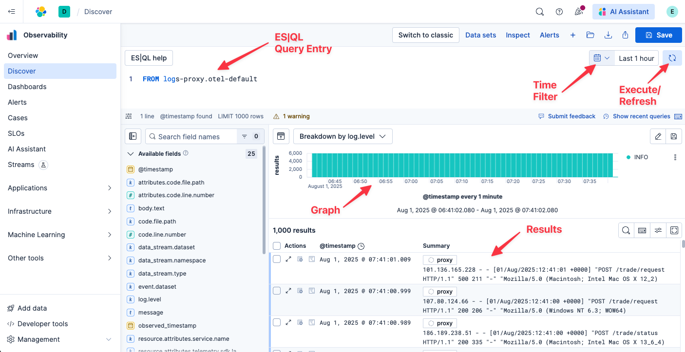

The advent of OpenTelemetry has forever changed how we capture observability signals. While OTel initially focused on delivering traces and metrics, support for collection of logs is now stable and gaining adoption, particularly in Kubernetes environments.

In this lab, we will explore several models for using OpenTelemetry to collect and parse logs.

Getting Our Bearings
===

In this lab, we will be working with an exemplary stock trading system, comprised of several services and their dependencies, all instrumented using [OpenTelemetry](https://opentelemetry.io).

Our trading system is composed of:
* `proxy`: a nginx reverse proxy which proxies requests from the outside into the trading system
* `trader`: a python application that trades stocks on orders from customers
* `router`: a node.js application that routes committed trade records
* `recorder-java`: a Java application that records trades to a PostgreSQL database

Finally, we have `monkey`, a python application we use for testing our system that makes periodic, automated trade requests on behalf of fictional customers.

# Elasticsearch

We will be working with a live Elasticsearch instance, displayed in the browser tab to the left. We are currently looking at Elastic's dynamically generated Service Map. It shows all of the services that comprise our system, and how they interact with one another.

> [!NOTE]
> You are welcome to explore each service and our APM solution by clicking on each service icon in the Service Map and selecting `Service Details`

When you are ready, let's quick pivot to Discover where we can easily query and parse our logs. To do so, click `Discover` in the left-hand navigation pane

This workshop will leverage [ES|QL](https://www.elastic.co/docs/reference/query-languages/esql), Elastic's query-time language, to query our logs. Please refer to the following diagram to familiarize yourself with the ES|QL interface in Discover. You can enter your queries in the pane at the top of the Elasticsearch Discover. You can change the time window of your search using the Time Filter. To execute a search, click the Play/Refresh icon.

When you are ready, click the `Next` button to continue.
