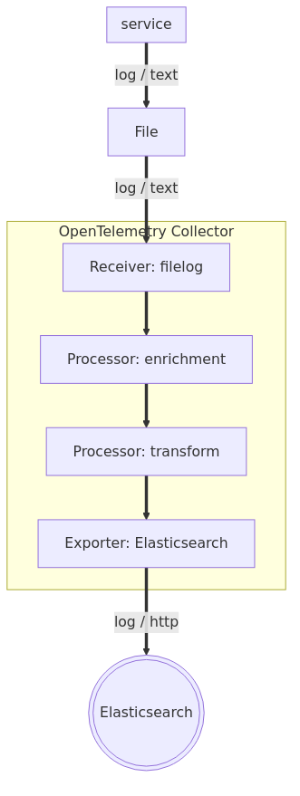

There are many reasons why use of OTLP-based logging may be impractical. Chief among them is accommodating services which cannot be instrumented with OpenTelemetry (e.g., third-party services). These services simply write their logs to disk directly, or more commonly to stdout, which is then written to disk by the Kubernetes or Docker logging provider, for example.

To accommodate such services, we can use the [filelog receiver](https://github.com/open-telemetry/opentelemetry-collector-contrib/tree/main/receiver/filelogreceiver) in the OTel Collector. In many regards, the `filelog` receiver is the OTel equivalent of Elastic's filebeat (often running as a module inside Elastic Agent).



Getting our bearings
===
In this example, we will be working with a service which outputs logs to stdout in a custom JSON format.

Let's first examine the raw JSON logs as they are currently being received by Elasticsearch:
1. Open the [button label="Elasticsearch"](tab-0) tab
2. Execute the following query:
```esql
FROM logs-*
| WHERE service.name == "router"
```
3. Open the first log record by clicking on the double arrow icon under `Actions`
4. Click on the `Log overview` tab

Note that the body of the message is not particularly useable:
* it has a "burned-in" JSON format
* it contains both the message ("0") and associated metadata ("_meta")
* the log level as presented by Elasticsearch will always be `INFO` regardless of the actual log level

# Checking the Source
Now let's validate that these logs are indeed being emitted to stdout and written to disk:

1. Open the [button label="Terminal"](tab-4) tab
2. Execute the following to get a list of the active Kubernetes pods that comprise our trading system:
```bash,run
kubectl -n trading get pods
```
3. Find the active `router-...` pod in the list
4. Get stdout logs from the active `router` pod:
```bash,nocopy
kubectl -n trading logs <router-...>
```
(replace ... with the pod instance id)

Note that the logs are being written to stdout and are being captured by the Kubernetes logging provider. Let's validate that Kubernetes is writing this log stream to disk:

1. Open the [button label="Terminal"](tab-4) tab
2. Get all log files associated with pods
```bash,run
cd /var/log/pods/
ls
```
3. Get logs for current instant of the `router` pod
```bash,run
cd trading_router*
ls
cd router
ls
```
4. Look at the router container logs
```bash,run
cat 0.log
```

Yup! Clearly these logs are being written to disk.

Parsing JSON logs
===
Many custom applications log to a JSON format to provide some structure to the log line. To fully appreciate this benefit in a logging backend, however, you need to parse that JSON (embedded in the log line) and extract fields of interest.

While you could do this with Elasticsearch using Streams (as we will see in the future challenge), with OpenTelemetry, this can also be done at the edge in the Collector using [OTTL](https://opentelemetry.io/docs/collector/transforming-telemetry/).

# OTTL Playground
Crafting OTTL in a vacuum is tricky: the feedback loop of crafting OTTL, deploying it to the collector, validating it has the correct syntax, and validating it does what you expect can be long and painful.

Fortunately, there is a better way! Elastic has made available the [OTTL Playground](https://ottl.run): a tool to interactively refine your OTTL before putting it in production.

1. Open the [button label="OTTL Playground"](tab-1) tab
2. Paste into the `OTLP Payload` pane an example from our JSON formatted `router` logs:
```json
{
  "resourceLogs": [
    {
      "resource": {},
      "scopeLogs": [
        {
          "scope": {},
          "logRecords": [
            {
              "timeUnixNano": "1544712660300000000",
              "observedTimeUnixNano": "1544712660300000000",
              "severityNumber": 10,
              "severityText": "Information",
              "traceId": "5b8efff798038103d269b633813fc60c",
              "spanId": "eee19b7ec3c1b174",
              "body": {
                "stringValue": "{\"0\": \"routing request to http://recorder-java:9003\",  \"_meta\": {    \"runtime\": \"Nodejs\",    \"runtimeVersion\": \"v20.19.5\",    \"hostname\": \"router-689cd9bd99-khtfx\",    \"name\": \"router\",    \"parentNames\": \"[undefined]\",    \"date\": \"2025-09-20T11:59:59.741Z\",    \"logLevelId\": 3,    \"logLevelName\": \"INFO\",    \"path\": {      \"fullFilePath\": \"/home/node/app/app.ts:35:10\",      \"fileName\": \"app.ts\",      \"fileNameWithLine\": \"app.ts:35\",      \"fileColumn\": \"10\",      \"fileLine\": \"35\",      \"filePath\": \"/app.ts\",      \"filePathWithLine\": \"/app.ts:35\",      \"method\": \"customRouter\"    }  }}"
              }
            }
          ]
        }
      ]
    }
  ]
}
```
3. Paste into the `Configuration` pane the following:
```yaml
            log_statements:
              - context: log
                conditions:
                  - body != nil and Substring(body, 0, 2) == "{\""
                statements:
                  - set(cache, ParseJSON(body))
                  - flatten(cache, "")
                  - merge_maps(attributes, cache, "upsert")
```

Those initial set of log statements:
1. check if the message body is JSON formatted
2. if so, parses the body as json, flattens the key names (to prevent nesting), and merges all extracted keys to `attributes`

Click on the `Run >` button. In the `Result` pane, you can see the diff of what this OTTL would do, and it _kind of_ matches what we expect.

It is far from ideal:
* it does not conform to OTel semantic conventions (e.g., `_meta.logLevelName`, `_meta.date`)
* the message body is stored as an attribute with key `0`

Let's clean that up with OTTL!

1. Paste the following into the `Configuration` pane:
```yaml
            log_statements:
              - context: log
                conditions:
                  - body != nil and Substring(body, 0, 2) == "{\""
                statements:
                  - set(cache, ParseJSON(body))
                  - flatten(cache, "")
                  - merge_maps(attributes, cache, "upsert")

                  - set(time, Time(attributes["_meta.date"], "%Y-%m-%dT%H:%M:%SZ"))
                  - set(severity_text, attributes["_meta.logLevelName"])
                  - set(severity_number, attributes["_meta.logLevelId"])
                  - delete_matching_keys(attributes, "_meta\\..*")

                  - set(body, attributes["0"])
                  - delete_key(attributes, "0")
```
2. Click on the `Run >` button

Ah, that looks much better! Here, we are:
* converting the date from a string to an epoch timestamp and copying it into the proper semantic convention (semcon) field
* copy the log level into the proper semcon fields
* deleting the remaining `_meta.*` fields
* copying the body from `attributes.0` to the proper semcon field
* deleting the now defunct `attributes.0`

This looks great. Let's put this configuration into production!

# Putting It Into Production

1. Open the [button label="Collector Config"](tab-2) tab
2. Open the file `values.yaml`
3. Find the following block under `collectors/daemon/config/processors`:
```yaml,nocopy
        transform/parse_json_body:
            error_mode: ignore
            # WORKSHOP CONTENT GOES HERE
```
4. Replace it with the OTTL we developed above:
```yaml
        transform/parse_json_body:
            error_mode: ignore
            log_statements:
              - context: log
                conditions:
                  - body != nil and Substring(body, 0, 2) == "{\""
                statements:
                  - set(cache, ParseJSON(body))
                  - flatten(cache, "")
                  - merge_maps(attributes, cache, "upsert")

                  - set(time, Time(attributes["_meta.date"], "%Y-%m-%dT%H:%M:%SZ"))
                  - set(severity_text, attributes["_meta.logLevelName"])
                  - set(severity_number, attributes["_meta.logLevelId"])
                  - delete_matching_keys(attributes, "_meta\\..*")

                  - set(body, attributes["0"])
                  - delete_key(attributes, "0")
```

Now let's redeploy the OTel Operator with our updated config:

1. Open the [button label="Terminal"](tab-3) tab
2. Execute the following:
```bash,run
helm upgrade --install opentelemetry-kube-stack open-telemetry/opentelemetry-kube-stack --force \
  --namespace opentelemetry-operator-system \
  --values 'collector/values.yaml' \
  --version '0.9.1'
```

This will redeploy the OTelOperator, which in turn will restart the daemonset Collectors with their new config. We can check when the new configuration has taken affect by looking at the status of the daemonset Collectors.

1. Open the [button label="Terminal"](tab-3) tab
2. Execute the following:
```bash,run
kubectl -n opentelemetry-operator-system get pods
```

When you see that the replacement daemonset Collectors have been up for at least 30 seconds, let's check the logs coming into Elastic:

1. Open the [button label="Elasticsearch"](tab-0) tab
2. Click `Discover` in the left-hand navigation pane
3. Execute the following query:
```esql
FROM logs-*
| WHERE service.name == "router"
| WHERE message LIKE "routing request*"
```
4. Open the first log record by clicking on the double arrow icon under `Actions`
5. Click on the `Log overview` tab

> [!NOTE]
> you may have to refresh the ES|QL query several times before results are present

Yes! Note that cleanly parsed JSON logs:
* the message body is now just the message
* the log level and timestamp are set correctly

Handling Structured Logging
===

Let's take advantage of the support for structured logging in the [tslog](https://tslog.js.org/) package.

1. Open the [button label="Router Source"](tab-3) tab
2. Navigate to `app.ts`
3. Find the line in the function `customRouter()`
```ts,nocopy
logger.info(`routing request to ${host}`);
```
4. Modify it to read:
```ts
logger.info(`routing request to ${host}`, {'com.example.method': method});
```

This will add the routing method selected to the log line in a structured manner.

Now let's recompile and redeploy our `router` service:
1. Open the [button label="Terminal"](tab-3) tab
2. Execute the following:
```bash,run
./builddeploy.sh -s router
```

Now let's see how this looks in Elasticsearch:
1. Open the [button label="Elasticsearch"](tab-0) tab
2. Click `Discover` in the left-hand navigation pane
3. Execute the following query:
```esql
FROM logs-*
| WHERE service.name == "router"
| WHERE message LIKE "routing request*"
| WHERE "attributes.1.com.example.method" IS NOT NULL
```
4. Open the first log record by clicking on the double arrow icon under `Actions`
5. Click on the `Attributes` tab

> [!NOTE]
> you may have to refresh the ES|QL query several times before results are present

Ok. We see `1.com.example.method`, but that's ugly. Let's fix it with OTTL!

1. Open the [button label="OTTL Playground"](tab-1) tab
2. Paste into the `OTLP Payload` pane an example from our JSON formatted `router` logs with the new `method` key:
```json
{
  "resourceLogs": [
    {
      "resource": {},
      "scopeLogs": [
        {
          "scope": {},
          "logRecords": [
            {
              "timeUnixNano": "1544712660300000000",
              "observedTimeUnixNano": "1544712660300000000",
              "severityNumber": 10,
              "severityText": "Information",
              "traceId": "5b8efff798038103d269b633813fc60c",
              "spanId": "eee19b7ec3c1b174",
              "body": {
                "stringValue": "{\"0\": \"routing request to http://recorder-java:9003\",  \"1.com.example.method\": \"random\",  \"_meta\": {    \"runtime\": \"Nodejs\",    \"runtimeVersion\": \"v20.19.5\",    \"hostname\": \"router-689cd9bd99-khtfx\",    \"name\": \"router\",    \"parentNames\": \"[undefined]\",    \"date\": \"2025-09-20T11:59:59.741Z\",    \"logLevelId\": 3,    \"logLevelName\": \"INFO\",    \"path\": {      \"fullFilePath\": \"/home/node/app/app.ts:35:10\",      \"fileName\": \"app.ts\",      \"fileNameWithLine\": \"app.ts:35\",      \"fileColumn\": \"10\",      \"fileLine\": \"35\",      \"filePath\": \"/app.ts\",      \"filePathWithLine\": \"/app.ts:35\",      \"method\": \"customRouter\"    }  }}"
              }
            }
          ]
        }
      ]
    }
  ]
}
```
3. Press Run. Note the `1.com.example.method` attribute as expected.
4. Paste the following the `Configuration` pane:
```yaml
            log_statements:
              - context: log
                conditions:
                  - body != nil and Substring(body, 0, 2) == "{\""
                statements:
                  - set(cache, ParseJSON(body))
                  - flatten(cache, "")
                  - merge_maps(attributes, cache, "upsert")

                  - set(time, Time(attributes["_meta.date"], "%Y-%m-%dT%H:%M:%SZ"))
                  - set(severity_text, attributes["_meta.logLevelName"])
                  - set(severity_number, attributes["_meta.logLevelId"])
                  - delete_matching_keys(attributes, "_meta\\..*")

                  - set(body, attributes["0"])
                  - delete_key(attributes, "0")

                  - replace_all_patterns(attributes, "key", "\\d+\\.", "")
```
5. Press Run

Much better. That last line removes the numeric prefix from any attributes and seems to work as expected.

# Putting It Into Production

Let's put it into production, the same as before:
1. Open the [button label="Collector Config"](tab-2) tab
2. Open the file `values.yaml`
3. Replace your existing block under `collectors/daemon/config/processors`:
```yaml,nocopy
        transform/parse_json_body:
            error_mode: ignore
            ...
```
4. Replace with the OTTL we developed above:
```yaml
        transform/parse_json_body:
            error_mode: ignore
            log_statements:
              - context: log
                conditions:
                  - body != nil and Substring(body, 0, 2) == "{\""
                statements:
                  - set(cache, ParseJSON(body))
                  - flatten(cache, "")
                  - merge_maps(attributes, cache, "upsert")

                  - set(time, Time(attributes["_meta.date"], "%Y-%m-%dT%H:%M:%SZ"))
                  - set(severity_text, attributes["_meta.logLevelName"])
                  - set(severity_number, attributes["_meta.logLevelId"])
                  - delete_matching_keys(attributes, "_meta\\..*")

                  - set(body, attributes["0"])
                  - delete_key(attributes, "0")

                  - replace_all_patterns(attributes, "key", "\\d+\\.", "")
```

Now let's redeploy the OTel Operator with our updated config:

1. Open the [button label="Terminal"](tab-3) tab
2. Execute the following:
```bash,run
helm upgrade --install opentelemetry-kube-stack open-telemetry/opentelemetry-kube-stack --force \
  --namespace opentelemetry-operator-system \
  --values 'collector/values.yaml' \
  --version '0.9.1'
```

This will redeploy the OTelOperator, which in turn will restart the daemonset Collectors with their new config. We can check when the new configuration has taken affect by looking at the status of the daemonset Collectors.

1. Open the [button label="Terminal"](tab-3) tab
2. Execute the following:
```bash,run
kubectl -n opentelemetry-operator-system get pods
```

When you see that the replacement daemonset Collectors have been up for at least 30 seconds, let's check the logs coming into Elastic:

1. Open the [button label="Elasticsearch"](tab-0) tab
2. Click `Discover` in the left-hand navigation pane
3. Execute the following query:
```esql
FROM logs-*
| WHERE service.name == "router"
| WHERE message LIKE "routing request*"
| WHERE "attributes.com.example.method" IS NOT NULL
```
4. Open the first log record by clicking on the double arrow icon under `Actions`
5. Click on the `Log overview` tab

> [!NOTE]
> you may have to refresh the ES|QL query several times before results are present

Nice and clean JSON logs in Elastic: perfect.

Well almost. You'll note that we had to modify the configuration of the Collector in the daemonset; the same Collector which handles logs from all of our services. Imagine we have multiple services, each which outputs a unique JSON schema. In that case, we would have to introduce routing in our Collector pipelines in order to selectively apply the right OTTL for a given log source... What if there was a way that the services themselves could specify their configuration?
