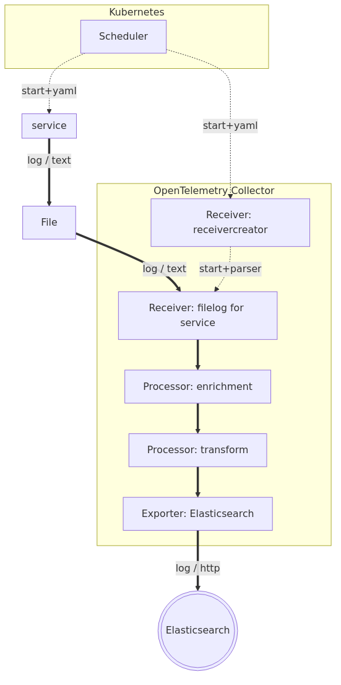

Modifying the Collector config to parse specific logs feels awkward. Ideally, we could push bespoke parsing configurations to the deployment of the app or service itself. Realistically, it is the service which is in the best position to know the nuances of its custom logging pattern.

Fortunately, on Kubernetes, just such an option exists: the [Receiver Creator](https://github.com/open-telemetry/opentelemetry-collector-contrib/blob/main/receiver/receivercreator/README.md) can be used to dynamically instantiate `file` receivers with a custom configuration driven by the deployment yaml of each service.



Getting our bearings
===
Let's have a look at our postgresql logs. These are being generated by postgresql, writing to stdout, captured by the Kubernetes log provider, and written to disk.

1. Open the [button label="Elasticsearch"](tab-0) tab
2. Click `Discover` in the left-hand navigation pane
3. Execute the following query:
```esql
FROM logs-*
| WHERE service.name == "postgresql"
```
4. Open the first log record by clicking on the double arrow icon under `Actions`
5. Click on the `Log overview` tab

Note the presence of a `traceparent` field burned into some of the log lines. Recall that these logs are generated from postgresql directly. Postgresql at present is not OpenTelemetry enabled, and thus has no native provisions for accepting a `traceparent` via distributed tracing and appending it to log lines. How did this line get there?

[SQL Commentor](https://google.github.io/sqlcommenter/) is a library that can be used by Java applications making SQL calls (here, `recorder-java`). SQL Commentor will look for an active OpenTelemetry trace and append the appropriate `traceparent` header as a comment to the SQL query. Most SQL databases (including postgresql) will output the comment as part of the audit log!

Configuring the Receiver Creator
===

We've already modified the OpenTelemetry Collector Config to accommodate the Receiver Creator. Let's have a look at the modified configuration:

1. Open the [button label="Collector Config"](tab-1) tab
2. Open the `values.patch` file

Configuring the Service
===
Now we need to modify our `postgresql.yaml` to include our parsing directives.

1. Open the [button label="postgresql Config"](tab-2) tab
2. Open the file `postgres.yaml`
3. Find the following lines under `spec/template/metadata/annotations`:
```yaml,nocopy
      annotations:
        io.opentelemetry.discovery.logs/enabled: "true"
        # WORKSHOP CONTENT GOES HERE
```
4. Replace it with the following:
```yaml
      annotations:
        io.opentelemetry.discovery.logs/enabled: "true"
        io.opentelemetry.discovery.logs/config: |
          operators:
          - type: container
          - type: regex_parser
            on_error: send_quiet
            parse_from: body
            regex: '^(?P<timestamp_field>\d{4}-\d{2}-\d{2}\s\d{2}:\d{2}:\d{2}.\d{3}\s[A-z]+)\s\[\d+\]\s(?P<severity_field>[A-Z]+):\s*(?<msg_field>.*?)\s*(\/\*traceparent=\x27(?P<version>\d*)?-(?P<trace_id>\S*)-(?P<span_id>\S*)-(?P<trace_flags>\d*)\x27\*\/)?$'
            timestamp:
              parse_from: attributes.timestamp_field
              on_error: send_quiet
              layout_type: strptime
              layout: '%Y-%m-%d %H:%M:%S.%L %Z'
            trace:
              trace_id:
                parse_from: attributes.trace_id
                on_error: send_quiet
              span_id:
                parse_from: attributes.span_id
                on_error: send_quiet
              trace_flags:
                parse_from: attributes.trace_flags
                on_error: send_quiet
            severity:
              parse_from: attributes.severity_field
              on_error: send_quiet
              mapping:
                warn:
                  - WARNING
                  - NOTICE
                error:
                  - ERROR
                info:
                  - LOG
                  - INFO
                  - STATEMENT
                debug1:
                  - DEBUG1
                debug2:
                  - DEBUG2
                debug3:
                  - DEBUG3
                debug4:
                  - DEBUG4
                debug5:
                  - DEBUG5
                fatal:
                  - FATAL
                  - PANIC
          - type: move
            on_error: send_quiet
            from: attributes.msg_field
            to: body
          - type: remove
            on_error: send_quiet
            field: attributes.timestamp_field
          - type: remove
            on_error: send_quiet
            field: attributes.severity_field
          - type: remove
            on_error: send_quiet
            field: attributes.trace_id
          - type: remove
            on_error: send_quiet
            field: attributes.span_id
          - type: remove
            on_error: send_quiet
            field: attributes.trace_flags
```

This configuration applies a regex to parse postgresql audit lines. As you can see:
* it extracts and appropriately sets the timestamp
* it extracts and appropriately sets the log level
* it extracts and appropriately sets the `trace.id` and `span.id`

> [!NOTE]
> You'll note that Receiver Creator unfortunately uses a different language than OTTL. This is largely because the Receiver Creator does its processing within the receiver itself. Currently, only Processors speak OTTL; manipulation of signals in the receivers is limited to the similar, but of course different, `operators` lingua.

Now apply the modified `postgres.yaml` Kubernetes deployment yaml:
1. Open the [button label="Terminal"](tab-3) tab
2. Execute the following:
```bash,run
./deploy.sh -s postgresql
./deploy.sh -s recorder-java
```

This will redeploy `postgresql` with the modified deployment yaml.

We can check that by describing the pod.
1. Open the [button label="Terminal"](tab-3) tab
2. Execute the following
```bash,run
kubectl -n trading describe pod postgresql
```

Note the `Annotations` as expected.

And let's check that the daemonset Collector received the directive to create a new receiver for `postgresql`:
1. Open the [button label="Terminal"](tab-3) tab
2. Execute the following to get a list of the active Kubernetes pods that comprise our trading system:
```bash,run
kubectl -n opentelemetry-operator-system get pods
```
3. Find the active `opentelemetry-kube-stack-daemon-collector...` pod in the list
4. Get stdout logs from the active `opentelemetry-kube-stack-daemon-collector` pod:
```bash,nocopy
kubectl -n opentelemetry-operator-system logs <opentelemetry-kube-stack-daemon-collector-...> | grep "starting receiver"
```
(replace ... with the pod instance id)

And find the `starting receiver` message which shows `postgresql` starting up and being configured.

Verifying our Changes
===

Let's check to see if our logs are being parsed as expected.
1. Open the [button label="Elasticsearch"](tab-0) tab
2. Click `Discover` in the left-hand navigation pane
3. Execute the following query:
```esql
FROM logs-* WHERE service.name == "postgresql"
```
4. Open the first log record by clicking on the double arrow icon under `Actions`
5. Click on the `Log overview` tab

Indeed, you'll note that the timestamp, log level, and `trace.id` are now being set as expected.

We can also check to see how our `postgresql` logs magically integrate into our distributed trace logs:
1. Open the [button label="Elasticsearch"](tab-0) tab
2. Click `Applications` > `Service Inventory` in the left-hand navigation pane
3. Click on the `Service Map` tab
4. Click on the `trader` service
5. Click on `Service Details`
6. Click on the `Transactions` tab
7. Scroll down and click on the `POST /trade/request` transaction under `Transactions`
8. Scroll down to the waterfall graph under `Trace sample`
9. Click on the `Logs` tab
10. Click on the `execute <unnamed>: ...` log line emitted by the `postgresql` service
11. Click on the `Table` tab
12. Search for the attribute `trace.id`

Correlated SQL audit logs with our trace logs! Amazing!
