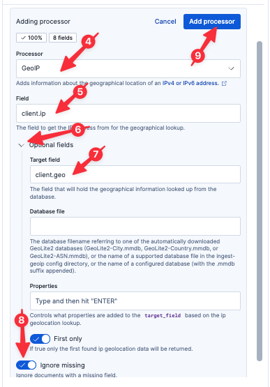

An alternative to parsing logs at the edge is to use Elastic's Streams framework to parse the logs as they are ingested into Elastic. This has several distinct advantages to edge-based parsing:
* failure store to handle logs which fail parsing rules
* a nice UX to build regex and GROK expressions
* AI Assistance to help build regex and GROK expressions
* a library of additional parsing tools (like parsing User Agent or Client IP, for example)

Parsing with Streams
===

Let's say we want to parse custom logs coming from our nginx reverse proxy. We've started with the defacto nginx log format, but added an additional field which makes it more challenging to use a simple OOTB integration.

1. Select `logs-proxy.otel-default` from the list of data streams (if you start typing, Elasticsearch will help you find it)
2. Select the `Processing` tab

# Parsing the log message

We can parse our nginx log messages at ingest-time using the Elastic [Grok](https://www.elastic.co/docs/reference/enrich-processor/grok-processor) processor.

1. Click `Add a processor`
2. Select the `Grok` Processor (if not already selected)
3. Set the `Field` to
  ```
  body.text
  ```
4. Click `Generate pattern`. Elasticsearch will analyze your log lines and determine a suitable grok pattern.
5. To ensure a consistent lab experience, copy the following grok expression and paste it into the `Grok patterns` field (_do not_ click the `Accept` button next to the generated pattern)
```
%{IPV4:client.ip} - %{NOTSPACE:client.user} \[%{HTTPDATE:timestamp}\] "%{WORD:http.request.method} %{URIPATH:http.request.url.path} HTTP/%{NUMBER:http.version}" %{NUMBER:http.response.status_code:int} %{NUMBER:http.response.body.bytes:int} %{NUMBER:http.response.duration:float} "%{DATA:http.request.referrer}" "%{GREEDYDATA:user_agent.original}"
```
6. Wait until the sample `body.text` on the right shows highlighting, then click `Add processor`

# Parsing the timestamp

The nginx log line includes a timestamp; let's use that as our record timestamp.

1. Click `Add a processor`
2. Select `Date`
3. Set `Field` to `timestamp`
4. Elastic should auto-recognize the format: `dd/MMM/yyyy:HH:mm:ss XX`
5. Click `Add processor`

Let's analyze our clients by `client.ip` to look for possibly geographic patterns.

# Adding the GeoIP processor

We can add the Elastic [GeoIP](https://www.elastic.co/docs/reference/enrich-processor/geoip-processor) processor to geo-locate our clients based on their client IP address.

1. Select `logs-proxy.otel-default` from the list of Streams.
2. Select the `Processing` tab
3. Click `Add a processor`
4. Select the `GeoIP` Processor
5. Set the `Field` to
  ```
  client.ip
  ```
6. Open `Optional fields`
7. Set `Target field` to
  ```
  client.geo
  ```
8. Set `Ignore missing` to true
9. Click `Add processor`
10. Click `Save changes` in the bottom-right



Now save the Processing by clicking `Save changes` in the bottom-right.

Example Queries
===

Now let's jump back to Discover by clicking `Discover` in the left-hand navigation pane.

Execute the following query:
```esql
FROM logs-proxy.otel-default
| WHERE http.response.status_code IS NOT NULL
| KEEP @timestamp, client.ip, http.request.method, http.request.url.path, http.response.status_code, user_agent.original
```

> [!NOTE]
> you may have to refresh the ES|QL query several times before results are present


By employing the GeoIP processor, we can do some really neat stuff around client location.

Execute the following query:
```esql
FROM logs-proxy.otel-default
| WHERE client.geo.country_iso_code IS NOT NULL AND http.response.status_code IS NOT NULL
| STATS COUNT() BY http.response.status_code, client.geo.country_iso_code
| SORT http.response.status_code DESC
```
